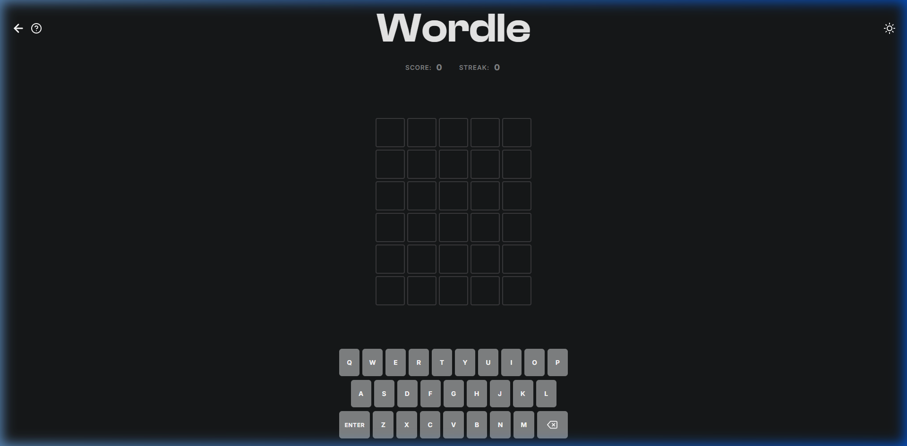

# 🎮 Wordle Game

Chào mừng bạn đến với trò chơi **Wordle**! Đây là một phiên bản web hiện đại, mượt mà của trò chơi đoán chữ nổi tiếng thế giới, được xây dựng bằng HTML, CSS và JavaScript thuần túy.

## ✨ Tính năng nổi bật

*   **Hai chế độ chơi:**
    *   **Daily Mode:** Thử thách với một từ khóa duy nhất mỗi ngày, cạnh tranh cùng bạn bè.
    *   **Classic Mode:** Chơi không giới hạn, giúp bạn rèn luyện kỹ năng và mở rộng vốn từ.
*   **Giao diện hiện đại:** Thiết kế theo phong cách Dark Mode sang trọng, hiệu ứng chuyển động mượt mà và tối ưu hóa cho cả máy tính lẫn thiết bị di động.
*   **Theo dõi tiến trình:** Hệ thống tự động lưu lại điểm số (**Score**) và chuỗi thắng (**Streak**) của bạn.
*   **Hỗ trợ bàn phím:** Bạn có thể sử dụng bàn phím vật lý hoặc bàn phím ảo ngay trên màn hình.

## 🕹️ Cách chơi

Mục tiêu của bạn là đoán một từ có 5 chữ cái trong tối đa 6 lần thử.

1.  Nhập một từ có 5 chữ cái hợp lệ và nhấn **Enter**.
2.  Sau mỗi lần đoán, màu sắc của các ô chữ sẽ thay đổi để cho biết mức độ chính xác của bạn:
    *   🟩 **Màu xanh lá:** Chữ cái nằm trong từ và **đúng vị trí**.
    *   🟨 **Màu vàng:** Chữ cái nằm trong từ nhưng **sai vị trí**.
    *   ⬛ **Màu xám:** Chữ cái **không nằm trong từ**.

## 🛠️ Công nghệ sử dụng

Dự án này được xây dựng hoàn toàn bằng các công nghệ web cơ bản, không sử dụng framework nặng nề, đảm bảo tốc độ tải trang cực nhanh:

*   **HTML5:** Cấu trúc game chuẩn SEO.
*   **CSS3:** Giao diện Responsive, Flexbox/Grid, hiệu ứng Animation/Transition.
*   **JavaScript (ES6+):** Xử lý logic game, quản lý trạng thái và lưu trữ LocalStorage.

## 🚀 Cài đặt và Chạy thử

Bạn không cần cài đặt gì cả! Chỉ cần tải bộ mã nguồn về và mở file `index.html` trên bất kỳ trình duyệt nào (Chrome, Firefox, Edge,...) để bắt đầu chơi ngay lập tức.

---
*Chúc bạn có những giây phút giải trí thú vị với Wordle!* 🧩
